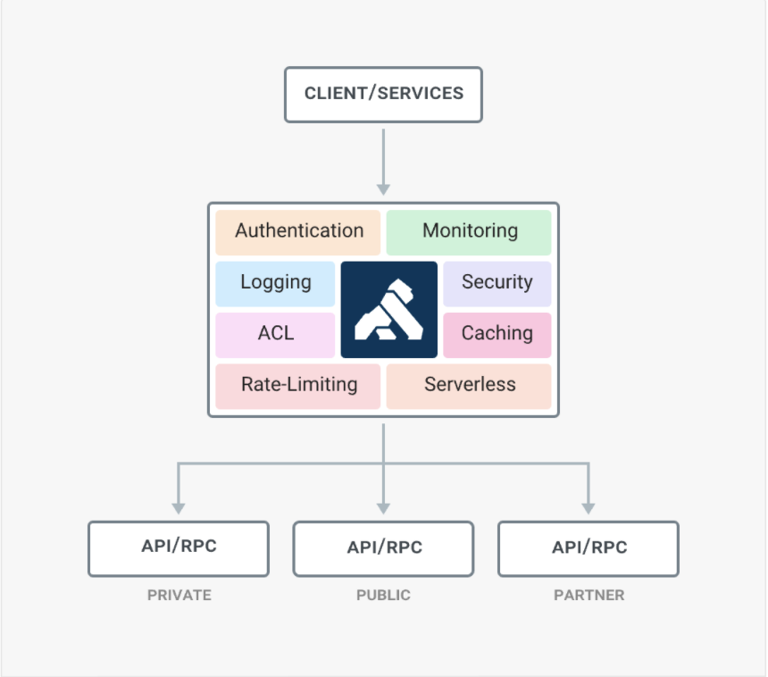
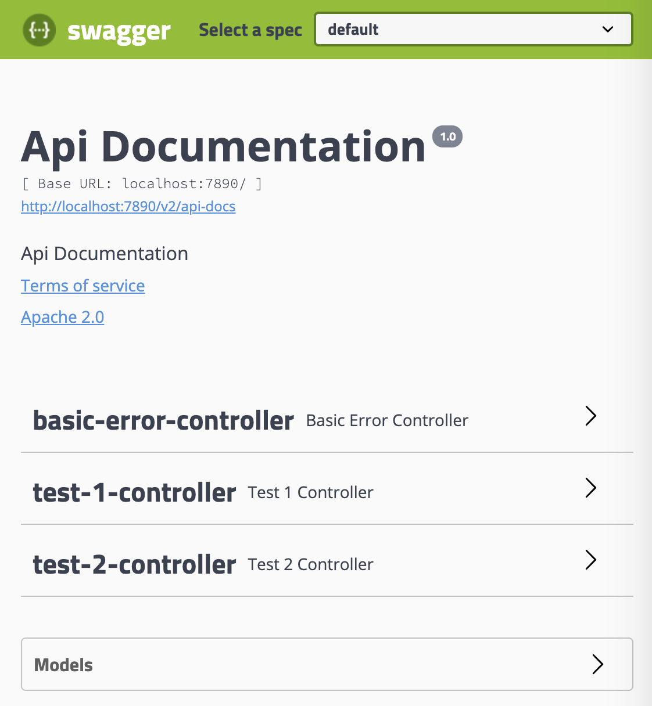

## Spring boot와 Kong API Gateway를 이용한 REST API 관리 - for Mac
> 시나리오<br>
1. Docker를 통해 kong api gateway 를 구동
2. Spring boot 를 이용하여 간단한 REST API 서버를 구성
3. Spring boot 와 Swaager 를 연동하여 REST API를 문서화
4. kong api gateway에 spring으로 구현된 REST API를 분리하여 2개를 등록
5. kong api gateway에 consumer를 추가하고 key-auth 플러그인을 설치하여 키발급
6. 발급 받은 키를 통하여 REST API에 접근
7. kong api gateway에 ACL 플러그인을 설치하여 등록된 2개의 REST API 각각 분리하여 관리하며 사용자에 대한 인가 처리
8. unirest 사용하여 테스트
9. Spring boot Actuator 및 Prometheus 설정
10. 끝

> 관련 용어<br>
+ REST API : Simple Web Service
+ API gateway : Web Service API Layer(Proxy)
+ ACL : Access Control list

> 사전 준비<br>

| 이름            | 내용           |
| :------------ | :-----------: |
| Open JDK 1.8     | -       |
| Spring boot 2.0.0    | REST API 구현          |
| Swagger 2.9.2    | REST API 문서화 라이브러리 |
| Docker | 클라우드 구성을 위한 도구 |
| Kong API Gateway | REST API 관리 |
| Konga | Kong Admin|
| Unirest 3.3.00 |  REST Call 라이브러리 |

> Kong API Gateway<br>
- 소개<br>
  Kong API Gateway는 API 레이어이며 개발자는 여러 API를 한 시스템에서 활용할 때 Kong을 사용 가능함<br>
    <br>
  [출처 : https://github.com/Kong/kong]
- 특징<br>
  인증, 보안, 통신 등 새로운 기능을 플러그인 형태로 제공<br>
- 장점<br>
  (1) 오픈 소스 프레크임워크<br>
  (2) Service, Route, Consumer 단위 플러그인 연결 할 수 있음<br>
- 단점<br>
  (1) HTTP 통신만 지원<br>
  (2) 플러그인 관리가 다소 어려움<br>
  (3) REST Call로만 설정을 해야함<br>
> Kong Docker 설정<br>

```
  (1) kong network 구성 : docker network create kong-net <br>
  (2) kong DB 실행 : docker run -d --name kong-database --network=kong-net -p 5432:5432 -e "POSTGRES_USER=kong" -e "POSTGRES_DB=kong" postgres:9.6 <br>
  (3) kong DB 마이그레이션 설치 :  docker run --rm --network=kong-net -e "KONG_DATABASE=postgres" -e "KONG_PG_HOST=kong-database" -e "KONG_CASSANDRA_CONTACT_POINTS=kong-database" kong:latest kong migrations bootstrap <br>
  (4) kong 실행 : docker run -d --name kong --network=kong-net -e "KONG_DATABASE=postgres" -e "KONG_PG_HOST=kong-database" -e "KONG_CASSANDRA_CONTACT_POINTS=kong-database" -e "KONG_PROXY_ACCESS_LOG=/dev/stdout" -e "KONG_ADMIN_ACCESS_LOG=/dev/stdout" -e "KONG_PROXY_ERROR_LOG=/dev/stderr" -e "KONG_ADMIN_ERROR_LOG=/dev/stdout" -e "KONG_ADMIN_LISTEN=0.0.0.0:8001, 0.0.0.0:8444 ssl" -p 8000:8000 -p 8443:8443 -p 8001:8001 -p 8444:8444 kong:latest <br>
    + Kong은 서비스 포트(8000)와 관리자 포트(8001)로 구성됨<br>
  (5) 구동 확인 : docker container ls
    + 정상적으로 구동 될 경우 kong, kong-database의 콘테이너가 구동됨
```
> Swagger 설정<br>

pom.xml
``` 
        <!-- 스웨거 기본 -->
        <dependency>
            <groupId>io.springfox</groupId>
            <artifactId>springfox-swagger2</artifactId>
            <version>2.9.2</version>
        </dependency>
        <!-- 스웨거 ui -->
        <dependency>
            <groupId>io.springfox</groupId>
            <artifactId>springfox-swagger-ui</artifactId>
            <version>2.9.2</version>
        </dependency>
```
SwaggerConfig.java
- 스웨거 기본 설정
```java
@Configuration
@EnableSwagger2
public class SwaggerConfig {
    @Bean
    public Docket api(){
        return new Docket(DocumentationType.SWAGGER_2)
                .select()
                .apis(RequestHandlerSelectors.any())
                .paths(PathSelectors.any())
                .build();
    }
}

```
WebConfig.java
- 스웨거 UI 설정
```java
@Configuration
public class WebConfig extends WebMvcConfigurationSupport {
    @Override
    public void addResourceHandlers(ResourceHandlerRegistry registry) {
        registry.addResourceHandler("swagger-ui.html")
                .addResourceLocations("classpath:/META-INF/resources/");
        registry.addResourceHandler("/webjars/**")
                .addResourceLocations("classpath:/META-INF/resources/webjars/");
        super.addResourceHandlers(registry);
    }
}
 
```
스웨거 UI 접속 : http://localhost:7890/swagger-ui.html<br>
  <br>
> REST API 구현<br>

Test1Controller.java, Test2Controller.java
```java
@RestController
@RequestMapping(value = "/test1")
public class Test1Controller {
    @RequestMapping(value="/check.do", method = RequestMethod.GET)
    public String check(){
        return "{'Result':'Ok!'}";
    }
    @GetMapping(value="/")
    public String root(){

        return "{'Result':'Hello Test1 Service!'}";
    }
}

```
MainClass.java
```java
@ComponentScan(basePackages = "service.rest")
@ComponentScan(basePackages = "config")
@SpringBootApplication
public class MainClass {
    public static void main(String args[]){

        SpringApplication.run(MainClass.class,args);

    }
}

```
> kong Docker 설정
 <br>
  - kong 도커 네트워크 생성 : docker network create kong-net <br>
  - kong DB 실행 : docker run -d --name kong-database --network=kong-net -p 5432:5432 -e "POSTGRES_USER=kong" -e "POSTGRES_DB=kong" postgres:9.6 <br>
  - kong DB 마이그레이션 설치 :  docker run --rm --network=kong-net -e "KONG_DATABASE=postgres" -e "KONG_PG_HOST=kong-database" -e "KONG_CASSANDRA_CONTACT_POINTS=kong-database" kong:latest kong migrations bootstrap <br>
  - 도커 kong 실행 : docker run -d --name kong --network=kong-net -e "KONG_DATABASE=postgres" -e "KONG_PG_HOST=kong-database" -e "KONG_CASSANDRA_CONTACT_POINTS=kong-database" -e "KONG_PROXY_ACCESS_LOG=/dev/stdout" -e "KONG_ADMIN_ACCESS_LOG=/dev/stdout" -e "KONG_PROXY_ERROR_LOG=/dev/stderr" -e "KONG_ADMIN_ERROR_LOG=/dev/stdout" -e "KONG_ADMIN_LISTEN=0.0.0.0:8001, 0.0.0.0:8444 ssl" -p 8000:8000 -p 8443:8443 -p 8001:8001 -p 8444:8444 kong:latest <br>
    + Kong은 서비스 포트(8000)와 관리자 포트(8001)로 구성됨<br>

> kong 연동 <br>
```
1. Add your Service using the Admin API <br>
  - 서비스 등록 <br>
curl -i -X POST --url http://localhost:8001/services/ --data ‘name=test1’ --data ‘url=http://127.0.0.1:7890/test1/' <br>
curl -i -X POST --url http://localhost:8001/services/ --data ‘name=test2’ --data ‘url=http://127.0.0.1:7890/test2/' <br>

2. Add a Route for the Service <br>
curl -i -X POST --url http://localhost:8001/services/test1/routes --data ‘hosts[]=test1-host’  <br>
curl -i -X POST --url http://localhost:8001/services/test2/routes --data ‘hosts[]=test2-host’  <br>

test. Forward your requests through Kong <br>
url -i -X GET --url http://localhost:8000/ --header ‘Host:test1-host’ <br>
url -i -X GET --url http://localhost:8000/ --header ‘Host:test2-host’ <br>

3. Configure the key-auth plugin <br>
curl -i -X POST  --url http://localhost:8001/services/test1/plugins/ --data 'name=key-auth' <br>
curl -i -X POST  --url http://localhost:8001/services/test2/plugins/ --data 'name=key-auth' <br>

4. Create Consumer --header Host
curl -i -X POST --url http://localhost:8001/consumers/ --data "username=userA"

5. Create Consumer Key 
curl -i -X POST --url http://localhost:8001/consumers/userA/key-auth/ --data "key=1234"

6. Create ACL Group 
curl -X POST http://localhost:8001/routers/{route_id}/plugins --data "name=acl" --data "config.whitelist=test1-group" --data "config.hide_groups_header=false"
curl -X POST http://localhost:8001/routers/{route_id}/plugins --data "name=acl" --data "config.whitelist=test2-group" --data "config.hide_groups_header=false"

7. Create ACL Consumer Mapping
curl -X POST http://localhost:8001/consumers/userA/acls --data "group=test1-group"
```

> Unirest를 사용한 테스트<br>

사용법은 >>> https://github.com/Kong/unirest-java<br>
- maven dependency<br>
```xml
<!-- https://mvnrepository.com/artifact/com.konghq/unirest-java -->
<dependency>
    <groupId>com.konghq</groupId>
    <artifactId>unirest-java</artifactId>
    <version>3.3.00</version>
    <scope>provided</scope>
</dependency>
```
- API Call<br>
```java
   // 1. REST Call
   HttpResponse<String> response = Unirest.get("http://localhost:7890/test2")
                                          .header("username", "userA")
                                          .header("apikey","1234")
                                          .header("Host", "test2")
                                          .asString();
   // 2. Result
   System.out.println(response.getBody());

```
> 결과<br>
- 위의 설정대로 진행했을때 userA는 test1-group에 등록이 되며 test1-group이 아닌 다른 그룹에는 접근을 할 수 없음<br>
- 소속 그룹이 아닌 도메인으로 접근 시 아래와 같은 메시지를 발생함
```json
{
    "message": "You cannot consume this service"
}
```
- kong의 key-auth + ACL의 플러그인 조합을 통해 인증 및 인가의 문제도 해결
- 또한 한시스템에서 Path를 이용한 서비스 분리도 가능함

> `**Tip**` Unirest를 사용한 파일 업로드와 다운로드<br>
- 파일 업로드<br>
 ```java
    // 1. 파일 생성
    File file = new File("{filePath}");
    // 2. REST Call
    HttpResponse<String> response = Unirest.post("{restUrl}/{service}").field("file", file).asString();
```
- 파일 다운로드 클라이언트<br>
```java
    // 1. REST Call
    HttpResponse<byte[]> response = Unirest.post("{restUrl}/{service}").asString();
    // 2. 파일 이름 추출
    String fileName = r.getHeaders().getFirst("fileName");
    // 3. Body의 내용을 byte[]으로 변환
    byte[] content = r.getBody();
    // 4. 파일 저장
    FileOutputStream os = new FileOutputStream(new File("{파일경로}"+fileName));
    os.write(content);
    os.close();
```
- 파일 다운로드 서버<br>
```java
    @RequestMapping(value="/down.do", method = RequestMethod.POST)
       public ResonseEntity<Resource> down(){
       Path path = Paths.get("{파일경로}");
       HttpHeaders  headers = new HttpHeaders();
       headers.add("filename", path.getFileName().toString());
       Resource  resource = new InputStreamResource(Files.newInputStream(path));
       return new ResonseEntity<>(resource, headers, HttpStatus.OK);
   }
```

> Spring boot Actuator 및 Prometheus 설정<br>
(1) Spring boot Actuator